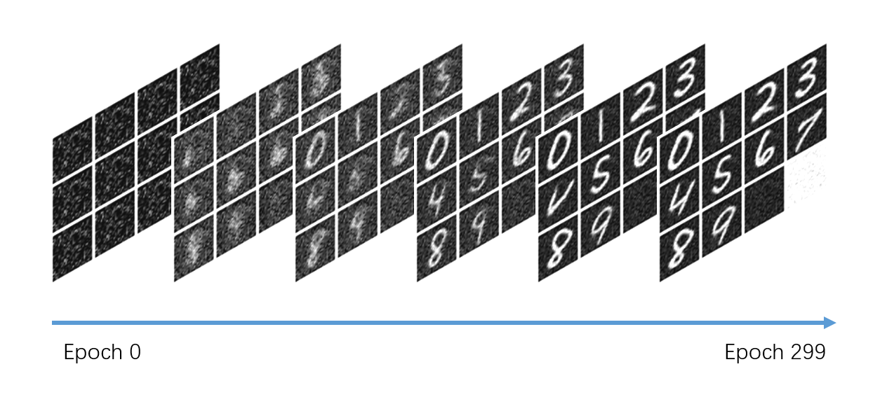

## 总览

模仿 Stable Diffusion 3 实现的 diffusion 模型，使用 MNIST 数据集进行训练。

本项目主要用于自己练习，熟悉扩散模型和流匹配模型的原理，以及模型训练过程。

- 使用 DiT 模型，包含 3 个 Transformer 层
- embedding 总维度 256，注意力头 4 个

训练 300 个 epoch。



## 运行代码

推荐看 `train.ipynb` 文件。若不习惯用 notebook 也可以运行 `train.py`，两者代码几乎一样。

数据集会在代码第一次运行时自动下载。训练过程产生的图像会输出到 `./training_images` 目录下。

推荐在 Linux 下运行代码。若是 Windows 请手动删掉与 `model.compile` 相关的代码。

需要安装的库：

```txt
torch>=2.5.1
lightning>=2.4.0
numpy>=1.26.4
scikit-learn>=1.5.2
scipy>=1.14.1
tqdm>=4.66.6
pandas>=2.2.3
ipykernel>=6.29.5
ipywidgets>=8.1.5
diffusers>=0.31.0
matplotlib>=3.9.2
pdm>=2.20.1
pytorch-lightning-quick-start-utils @ git+https://github.com/HiDolen/pytorch_lightning_quick_start_utils@v0.2.0
einops>=0.8.0
torchvision>=0.20.1
```

除了手动安装，还可以借助 pdm 来创建虚拟环节并安装所需库：

```bash
git clone https://github.com/HiDolen/diffusion_practice_with_mnist.git
pip install pdm
pdm install
```

然后使用 `pdm run python train.py` 来运行训练代码。

## 网络结构

主要使用了 Stable Diffusion 3 那套 DiT 的网络结构，简单来说是将用于图像生成的 UNet 换为了 Transformer 网络。

其他值得一提的细节：

- 位置编码使用了类似 FLUX 的二维 RoPE 编码
- 时间步采用正余弦编码，类别编码则使用 `nn.Embedding` 生成
- 用 AdaLayerNorm 层以缩放和偏移的形式将时间步信息施加到 Transformer 中
- 将类别嵌入视为单个 token 与图像序列一同参与 Transformer 处理，以此施加类别信息

训练时使用以下式子获得 $t$ 时刻的加噪图像 $x_t$：

$$
x_t=\sigma_t\epsilon+(1-\sigma_t)x_0
$$

其中 $x_0$ 为原始图像， $\sigma_t$ 为对应时间步 $t$ 的噪声占比， $\epsilon$ 为高斯噪声。

损失函数：

$$
\mathrm{loss}=\mathrm{MSE}(x_t - \epsilon, v_t)
$$

其中 $\epsilon$ 是从 $x_0$ 获得 $x_t$ 所使用的高斯噪声， $v_t$ 是模型预测结果。

一步采样：

$$
x_t=x_{t-1}+(\sigma_{t-1} - \sigma_t)v_t
$$

## 训练过程

使用 MNIST 数据集，约有六万张手写数字图片。额外添加一千张纯黑图和一千张纯白图参与训练。

batch_size 为 256，预热 1000 steps 后学习率维持在 2e-4。

总计训练 300 epoch，耗时一个半小时。模型参数占用空间 27MB，开启混合精度训练显存占用 2.5 GB。

其他说明：

- 借用 diffusers 库的 `FlowMatchEulerDiscreteScheduler` 生成 sigmas
- 训练时从 logit-norm 取样时间步而不是均匀采样，以提升训练效率（详见 [Stable Diffusion 3 的报告](https://arxiv.org/pdf/2403.03206)）

## 训练经验

- loss 大小不能直接表明学习效果。低 loss 也可能会出现糟糕的生成结果
- 过大的学习率会导致训练不稳定。实践下来将学习率设为 2e-4 已经是极限了
- 可以将 embedding 总维度降到 128。模型仍然能收敛，就是效果会打折扣
- 训练使用 offset noise 技巧效果不明显，训练使用 immiscible diffusion 技巧效果倒退。可能是不太适合 MNIST
- 将训练图像的方差归一化到 1 会极大提升训练稳定性

## 参考来源

感谢这些文章和项目。

- https://github.com/owenliang/mnist-dits
- https://github.com/TongTong313/rectified-flow
- 周弈帆，“Stable Diffusion 3 论文及源码概览”，https://zhouyifan.net/2024/07/14/20240703-SD3/
- 周弈帆，“Stable Diffusion 3「精神续作」FLUX.1 源码深度前瞻解读”，https://zhouyifan.net/2024/09/03/20240809-flux1/
- 来自 Stability AI 团队的 Stable Diffusion，以及来自 Black Forest Labs 团队的 FLUX.1
- Huggingface 的 diffusers 库：https://github.com/huggingface/diffusers
- “Scaling Rectified Flow Transformers for High-Resolution Image Synthesis”，https://arxiv.org/pdf/2112.10752
